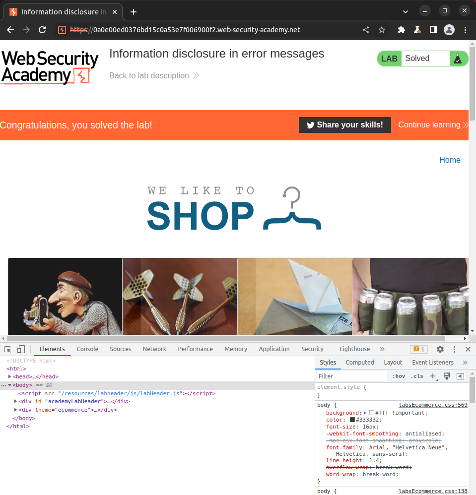
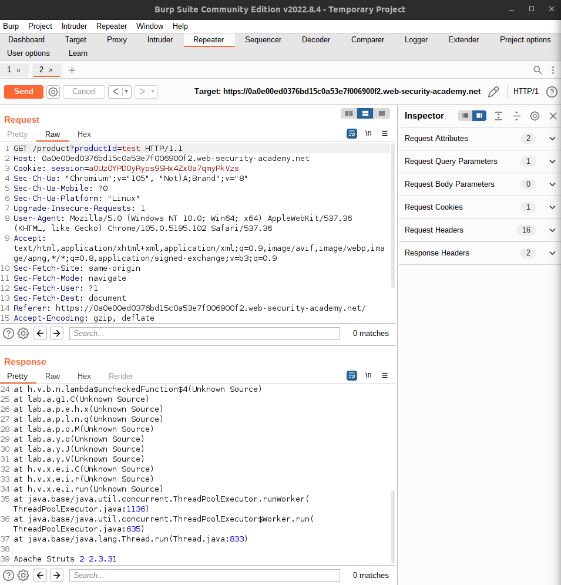
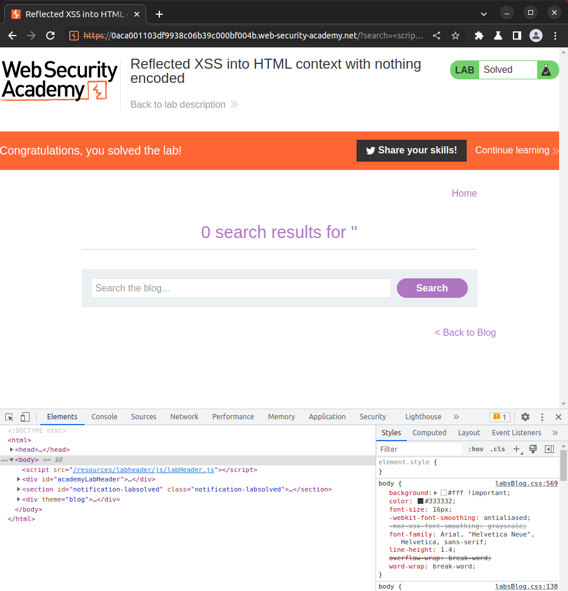

# Excessive Trust in Client Side Controls

## Buying a jacket for 0.01 USD. Actual value (1337 USD)

# Modifying HTTP requests with Burp Proxy

## Intercept and modify price in the POST cart request.

# Information disclosure in error messages

## Reissue requests with Burp Repeater

# XSS - Cross Site Scripting

- Reflected XSS, where the malicious script comes from the current HTTP request.
- Stored XSS, where the malicious script comes from the website's database.
- DOM-based XSS, where the vulnerability exists in client-side code rather than server-side code.

https://portswigger.net/web-security/cross-site-scripting

## Reflected XSS into HTML context with nothing encoded

