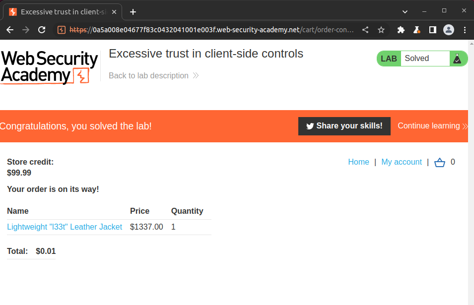
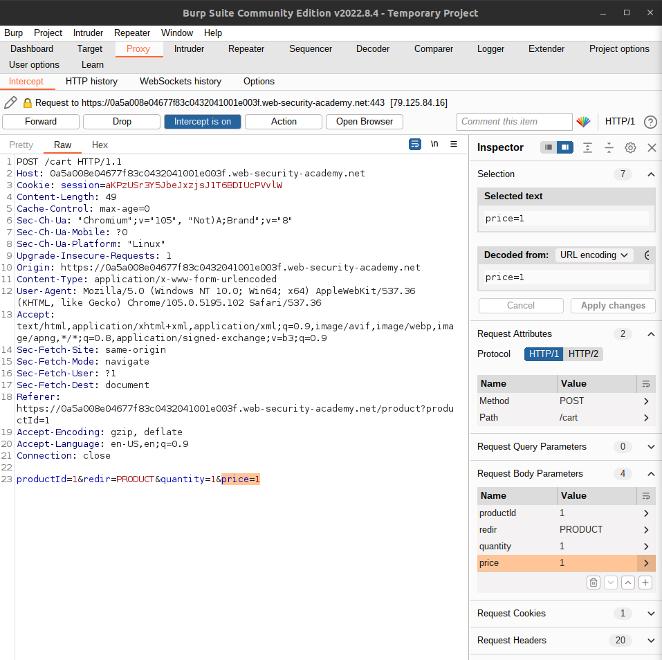

# Excessive Trust in Client Side Controls

## Buying a jacket for 0.01 USD. Actual value (1337 USD)

# Modifying HTTP requests with Burp Proxy

## Intercept and modify price in the POST cart request.

